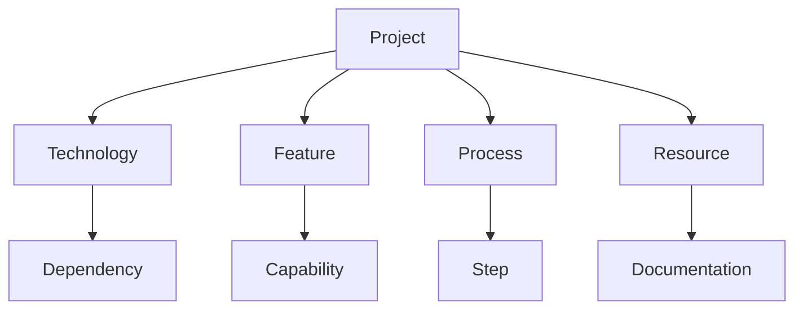

# Semantic Wiki Documentation

## Ontology

### Classes
- `Project`: The Shopify Enterprise Dashboard project
- `Technology`: Technical components and tools
- `Feature`: Project capabilities and functionalities
- `Process`: Development and operational procedures
- `Resource`: Project assets and documentation

### Properties
- `implements`: Links features to technologies
- `requires`: Dependencies between components
- `documents`: Links between documentation and components
- `manages`: Relationships between features
- `extends`: Inheritance relationships

### Relationships


## Knowledge Base

### Project [[Category:Project]]
- Name: Shopify Enterprise Dashboard
- Type: Web Application
- Purpose: Enterprise Store Management
- Status: Active Development

#### Components
- Frontend Framework: React 18
- UI Library: Shopify Polaris
- Database: Supabase
- API: Shopify Admin API

#### Architecture
- Pattern: Component-Based
- State Management: Zustand
- Data Layer: TanStack Query
- Authentication: Supabase Auth

### Technologies [[Category:Technology]]

#### Frontend [[Category:Frontend]]
- React
  - Version: 18.3.1
  - Purpose: UI Framework
  - Dependencies: react-dom, react-router-dom
  
- Shopify Polaris
  - Version: 12.10.0
  - Purpose: Design System
  - Dependencies: @shopify/polaris-icons

#### Backend [[Category:Backend]]
- Supabase
  - Purpose: Database & Authentication
  - Features: PostgreSQL, Row-Level Security
  - Integration: @supabase/supabase-js

#### Development [[Category:Development]]
- Vite
  - Purpose: Build Tool
  - Configuration: vite.config.ts
  - Scripts: dev, build, preview

### Features [[Category:Feature]]

#### Store Management
- Multi-Store Support
  - Implements: Store Connection
  - Manages: Store Data
  - Requires: Shopify API

#### Analytics
- Dashboard
  - Implements: Data Visualization
  - Uses: Recharts
  - Displays: Sales, Orders, Revenue

#### User Management
- Authentication
  - Implements: Supabase Auth
  - Manages: User Sessions
  - Features: Role-Based Access

### Processes [[Category:Process]]

#### Development
- Setup
  - Steps: Installation, Configuration
  - Requirements: Node.js, npm
  - Documentation: Installation.md

#### Deployment
- Build
  - Steps: Compile, Test, Deploy
  - Tools: Vite, TypeScript
  - Documentation: Deployment.md

#### Testing
- Types: Unit, Integration
- Tools: Vitest
- Coverage: Required

### Resources [[Category:Resource]]

#### Documentation
- Technical
  - API Reference
  - Component Documentation
  - Database Schema

- User
  - Installation Guide
  - User Manual
  - FAQ

#### Assets
- Icons
  - Source: Lucide React
  - Usage: UI Elements

- Styles
  - Framework: Tailwind CSS
  - Theme: Polaris Design System

## Semantic Queries

### Example Queries

#### Get All Technologies
```sparql
SELECT ?tech WHERE {
  ?tech rdf:type :Technology
}
```

#### Find Feature Dependencies
```sparql
SELECT ?feature ?dependency WHERE {
  ?feature :requires ?dependency
}
```

#### List Documentation by Category
```sparql
SELECT ?doc ?category WHERE {
  ?doc rdf:type :Documentation ;
       :category ?category
}
```

## Metadata

### Version Control
- Repository: Git
- Branching: feature/, fix/, docs/
- Commits: Conventional Commits

### Documentation Standards
- Format: Markdown
- Structure: Semantic Wiki
- Tools: Wiki.js

### Maintenance
- Updates: Regular
- Review: Quarterly
- Contributors: Development Team

## Integration

### Related Systems
- Shopify Admin
- Supabase Dashboard
- CI/CD Pipeline

### External Resources
- Shopify API Documentation
- Polaris Design Guidelines
- Supabase Documentation

### Tools
- Development IDE
- Version Control
- Documentation Platform

## Usage

### Navigation
1. Browse Categories
2. Search by Property
3. Follow Relationships
4. Query Data

### Contributing
1. Follow Structure
2. Maintain Relationships
3. Update Metadata
4. Add Semantic Tags

### Best Practices
- Use Consistent Terminology
- Maintain Relationships
- Keep Documentation Updated
- Follow Semantic Standards